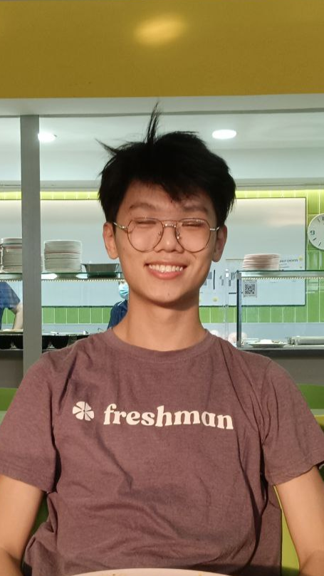
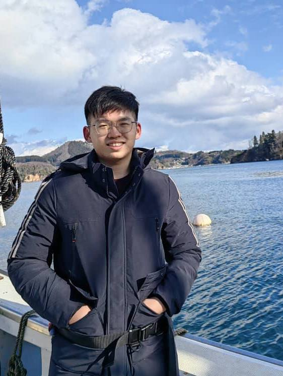

# About Us

We are a team based in the [School of Computing, National University of Singapore](http://www.comp.nus.edu.sg).

You can reach us at the email `ezcontact@gmail.com`

## Project team

### Koo Yu Cong

[[github](https://github.com/yucongkoo)]
[[portfolio](team/yucongkoo.md)]

* Role: Developer
* Responsibilities: Ensuring deliverables and deadlines are met

### Joshua Wee

[[github](http://github.com/jweewee)]
[[portfolio](team/jweewee.md)]

* Role: Integration
* Responsibilities: In charge of versioning of the code, maintaining the code repository, integrating various parts of the software to create a whole.

### Song Fang Yi

[[github](http://github.com/songfangyl)]
[[portfolio](team/songfangyl.md)]

* Role: Code quality
* Responsibilities: Looks after code quality, ensures adherence to coding standards.

### Lian Zhi Xuan

[[github](https://github.com/TehOPanas)] [[portfolio](team/tehopanas.md)]

* Role: Developer, Documentation
* Responsibilities: Responsible for the quality of various project documents

### Lam Jiu Fong

[[github](http://github.com/LamJiuFong)]
[[portfolio](team/lamjiufong.md)]

* Role: Developer, Code Testing
* Responsibilities: Ensures the testing of the project is done properly and on time

