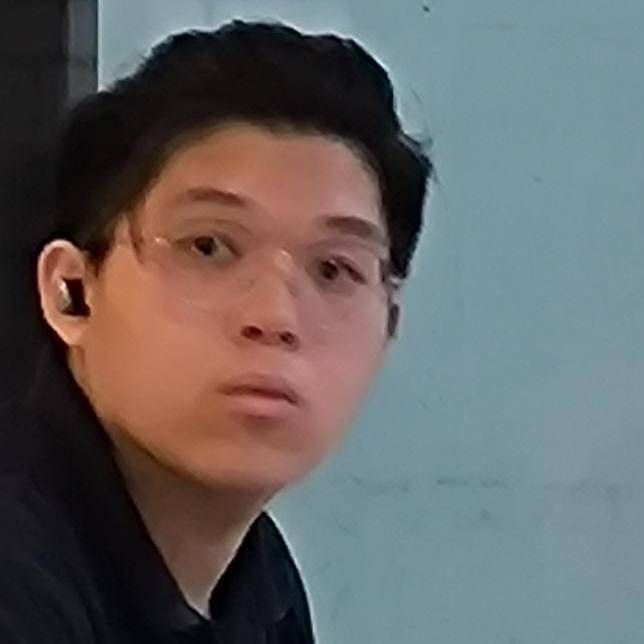

# About Us

We are a team based in the [School of Computing, National University of Singapore](http://www.comp.nus.edu.sg).

You can reach us at the email `seer[at]comp.nus.edu.sg`

## Project team

### Koo Yu Cong

[[github](https://github.com/yucongkoo)]
[[portfolio](team/yucongkoo.md)]

* Role: Developer
* Responsibilities: Ensuring deliverables and deadlines are met

### Joshua Wee

[[github](http://github.com/jweewee)]
[[portfolio](team/jweewee.md)]

* Role: Integration
* Responsibilities: In charge of versioning of the code, maintaining the code repository, integrating various parts of the software to create a whole.

### Lian Zhi Xuan

[[github](https://github.com/TehOPanas)] [[portfolio](team/lianzhixuan.md)]

* Role: Developer, Documentation
* Responsibilities: Responsible for the quality of various project documents

### Jean Doe

[[github](http://github.com/johndoe)]
[[portfolio](team/johndoe.md)]

* Role: Developer
* Responsibilities: Dev Ops + Threading

### James Doe

[[github](http://github.com/johndoe)]
[[portfolio](team/johndoe.md)]

* Role: Developer
* Responsibilities: UI
