# EzContact

<!-- * Table of Contents -->
<page-nav-print />

## Introduction

Welcome to the User Guide (UG) of **EZContact**

&emsp;&emsp;In the dynamic and ever-evolving world of insurance, staying connected and organized is paramount.
Meet EzContact, your go-to solution designed exclusively for insurance agents. Navigating the complex network of clients,
policies, and leads has never been easier. EzContact empowers you to manage your contacts, streamline communication,
and boost your productivity, all from the tips of your fingers.

&emsp;&emsp;EzContact is a desktop application that can help you organize your customers' information and reduce the
hassle of having to remember everything. It is optimized for use via Command Line Interface (CLI), meaning that users would
have to enter text command to execute them, while still having the benefits of Graphical User Interface (GUI) where users
can view the information easily through the application.

With EZContact, our users are able to :

*  Seamlessly organize their clients' details, policy information, and communication history.
*  Stay on top of their leads, and convert potential clients into loyal customers.
*  Schedule appointments and follow-ups without missing a beat.

&emsp;&emsp;If you are a fast typist, EzContact is the perfect tool for you to keep track of all your customer
, it is faster than any other traditional GUI-based application available in the market! Remember, Time is Money ! The
faster you approach your customer, the more deals you seal.

&emsp;&emsp;If you are interested in EzContact, hop on over to our [Quick Start](#quick-start) to get started and
embark on your journey of using EzContact.

## Quick start

1. Ensure you have Java `11` or above installed in your Computer.

2. Download the latest `EzContact.jar` from [here](https://github.com/AY2324S1-CS2103T-W16-2/tp/releases).

3. Copy the file to the folder you want to use as the _home folder_ for your EzContact.
4. Open a command terminal, `cd` into the folder you put the jar file in
5. After reaching the folder, execute the command `java -jar EzContact.jar`. The GUI similar to the below should appear in a few seconds.
Note how the app contains some sample data.  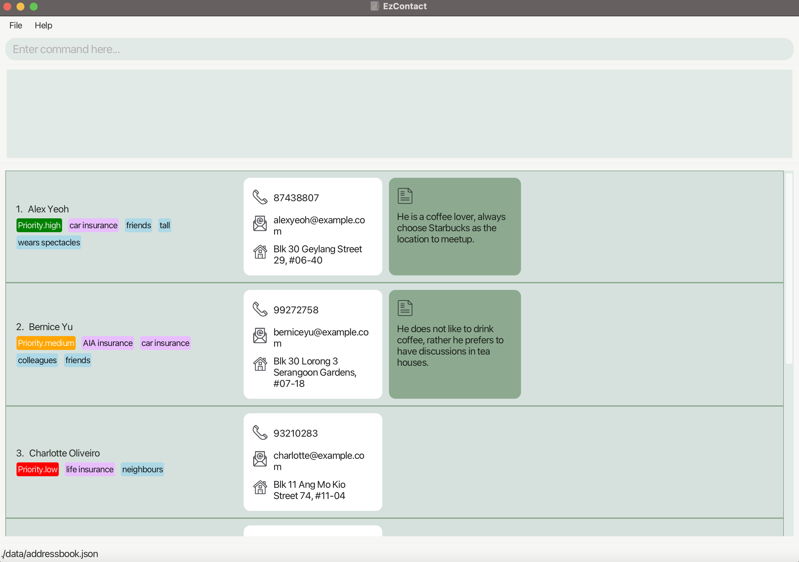
5. Type the command in the [Command Box](#ui-layout-description) and press Enter to execute it.
6. Refer to the [Features](#features) below for details of each command.

## UI Layout Description

Consider the following UI split into three parts:

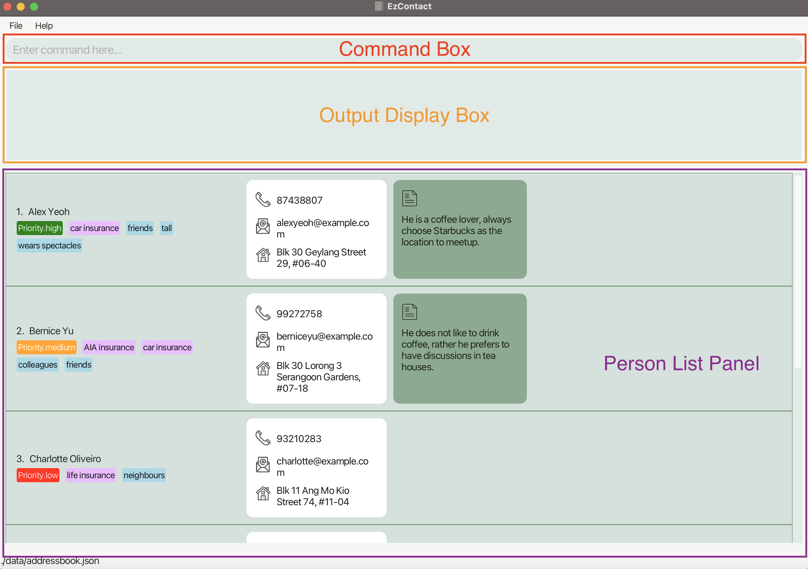

As illustrated above, the UI will be split into three sections, we will be providing a name for each section and
will be using these names to refer to the section specified in the following User Guide.

1. **Command Box:** Box for users to input the command to be executed by EzContact. 
1. **Result Display Box:** Box that displays the result of executing the entered command. 
1. **Customer List Panel:** Panel that displays the list of Customer Cards. 
   - **Customer Card:** Card that displays information about each customer. 

## Features

**Notes about the command format:** 

* Words in `<>` are the parameters to be supplied by the user. 
  e.g. in `add n/<name>`, `name` is a parameter which can be used as `add n/John Doe`.

* Items in `[]` are optional. 
  e.g `n/<name> [a/<address>]` can be used as `n/John Doe a/Kent Ridge` or as `n/John Doe`.

* Items with `…`​ after them can be used multiple times including zero times. 
  e.g. `[t/<tag>]…​` can be used as ` ` (i.e. 0 times), `t/friend`, `t/friend t/family` etc.

* Parameters can be in any order. 
  e.g. if the command specifies `n/<name> p/<phone number>`, `p/12341234 n/John` is also acceptable.

* Prefixes (e.g. `n/`, `p/`, `e/`) are designed to be short, however, we do still provide the functionality to detect
full-name prefixes ,and they can be used interchangeably(e.g. `n/` and `name/` are interchangeable),
click [here](#prefix-to-full-name-prefix-translation-table) to see a full table of prefix to full-name prefix relation.

* Extraneous parameters for commands that do not take in parameters (such as `help`, `list`, `exit` and `clear`) will be ignored. 
  e.g. if the command is `help 123`, it will be interpreted as `help`.

* Duplicate customer is defined as 2 person who have identical `<phone number>` or `<email>`.

* `<index>` must be value of between (1 -> 2147483647), any value out of this range will be considered as incorrect format;
whereas value in range but not in customer list is considered out of bound.

* Unless otherwise stated, when specifying restrictions on number of characters, spaces in between words
are included in the count, while leading and trailing spaces are excluded.

* If you are using a PDF version of this document, be careful when copying and pasting commands that span multiple lines as space characters surrounding line-breaks may be omitted when copied over to the application.

### Adding a customer: `add`

**Format:**

`add n/<name> p/<phone number> e/<email> [a/<address>] [pr/<priority>] [t/<tag>]... [i/<insurance>]... [r/<remark>]`

**Description:**

Adds a new customer with the respective details to EzContact.

<box type="warning" seamless>

**Caution:**
* `<name>` should be **alphanumeric**, **non-empty** and **not longer than 64 characters**.
* `<phone number>` should be an **8-digit number**(i.e. a Singapore number).
* `<email>` should be a **valid email address**(i.e. `local-part@domain`).
* `<address>` should **not be longer than 100 characters**.
* `<priority>` should **only be one of**: `high`, `medium`, `low`, `-` (all case-insensitive).
* `<tag>` should be **alphanumeric**, **non-empty** and **not longer than 20 characters(excluding spaces)**.
* `<insurance>` should be **alphanumeric**, **non-empty** and **not longer than 32 characters**.
* `<remark>` should **not be longer than 150 characters**.
* A customer **must not have more than 10 tags** assigned to it.
* A customer **must not have more than 5 insurances** assigned to it.
* Adding a [**duplicate customer**](#features) in EzContact is **not allowed**.
</box>

**Examples:**

* `add n/Ryan Ong p/64238876 e/ryanong@gmail.com t/tall t/skinny t/wears spectacles pr/medium i/car insurance` 
Adds the following [Customer Card](#ui-layout-description) to the [Customer List Panel](#ui-layout-description). Note how omission of optional parameters
are allowed.

### Deleting a customer : `delete`

**Format:**
`delete <index>`

**Description:**
* Deletes the customer at the specified `<index>`.
* `<index>` refers to the index number shown in the displayed customer list.

<box type="warning" seamless>

**Caution:**
* `<index>` should **only be one of** the indices shown in the displayed list.
</box>

**Examples:**
* `delete 2` deletes the 2nd customer in the displayed list.

Before:

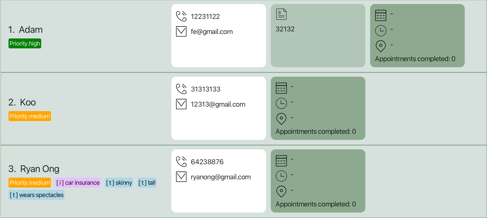

After:

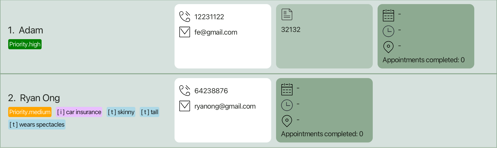

### Editing a customer : `edit`

**Format:** `edit <index> [n/<name>] [p/<phone number>] [e/<email>] [a/<address>]`

**Description:**
* Edits the customer at the specified `<index>`.
* `<index>` refers to the index number shown in the displayed customer list.
* If values are provided for certain fields, existing values of their respective fields will be edited to the provided values.
* If no value is provided, the values of the fields remain unchanged.

<box type="warning" seamless>

**Caution:**
* **At least one** of the optional fields must be provided.
* `<index>` should **only be one of** the indices shown in the displayed list.
* `<name>` should be **alphanumeric**, **non-empty** and **not longer than 64 characters**.
* `<phone number>` should be an **8-digit number**(i.e. a Singapore number).
* `<email>` should be a **valid email address**(i.e. `local-part@domain`).
* `<address>` should **not be longer than 100 characters**.
* Tags, Priorities, and Remarks are not editable.
* Editing a customer to have the same `<phone number>` or `<email>` to other existing customers will cause [**duplicate customer**](#features) error.

</box>

**Examples:**
*  `edit 3 n/Betsy Crower p/91234567 e/fong@example.com` edits the name, phone number and email address of the 3rd customer to be `Betsy Crower`, `91234567` and `fong@example.com` respectively.

Before:

After:

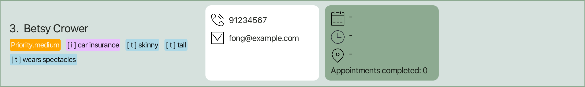

### Finding customers : `find`

**Format:**

`find [n/<keywords>] [p/<keywords>] [e/<keywords>] [a/<keywords>] [t/<keywords>] [i/<keywords>] [pr/<keywords>] [r/<keywords>]`

**Description:**

Search for customers with specified keywords of different attributes (except `appointment`).

* Attribute matches with the keywords when:
  - Any word in the attribute contains the single keyword as a prefix.
  - If there are multiple keywords, all keywords must be present in the attribute as prefix.
* Keywords are not case-sensitive and can be in any order.
* For `tag` and `insurance`, only one of the customer's `tags` / `insurances` has to contain the keywords as a prefix.  
These keywords can be spread across different `tag` / `insurance` entries.
* When searching with multiple attributes, the customer's attributes must match all the corresponding ones in `find`.

<box type="warning" seamless>

**Caution:**
* **At least one** of the optional fields must be provided.
* Keyword is **NOT** mandatory.

</box>

**Examples:**

* `find t/tall pr/h` finds all the customers whose tag matches keyword `tall`  and whose priority matches keyword `h` from the [Customer List](#ui-layout-description).

* `find i/car insurance pr/` finds all the customers whose insurance matches keyword `car insurance` and have priority from the [Customer List](#ui-layout-description).

<box type="info" seamless>

**Note**:

Note that if you search using `find n/Song Song`,  
it will match a customer named `Song Guo Xuan` because all the specified keywords are present in the customer's name.

</box>

### Tagging a customer: `tag`

**Format:** `tag <index> [at/<tag to add>]... [dt/<tag to delete>]...`

**Description:**

* Updates the tags assigned to the customer at `<index>` in the displayed customer list.
* Tags are not case-sensitive (i.e. `friends` is equivalent to `FriEnds`), the GUI will display tags in lower case.
* Contiguous spaces in between words will be treated as 1 single space.
* **Duplicate tags** to add/delete will be **ignored** by EzContact.
* **Adding an existing tag** or **deleting a non-existing tag** will be **ignored** by EzContact.

<box type="warning" seamless>

**Caution:**
* **At least one** `<tag to add>` or `<tag to delete>` should be provided.
* Adding and deleting the same tag is **not allowed**.
* `<index>` should **only be one of** the indices shown in the displayed list.
* `<tag to add>` and `<tag to delete>` should be **alphanumeric**, **non-empty** and **not longer than 20 characters(excluding spaces)**.
* The number of tags assigned to the customer after the update should **not exceed 10 tags**.
* The targeted customer's tags should **not remain unchanged** after the update command.

</box>

**Examples:**

* `tag 3 at/tall at/male dt/short dt/skinny` 
Adds `tall`(existing tag) and `male` tags, delete `short`(non-existing tag) and `skinny` tags from the third customer in the displayed customer list.

Before:

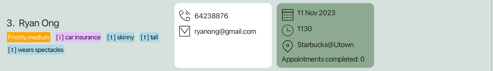

After:

### Updating insurance of a customer: `insurance`

**Format:**

`insurance <index> [ai/<insurance to add>]... [di/<insurance to delete>]...`

**Description:**

* Updated the insurance of the customer at `<index>` in the customer list
* **Duplicate insurances** to add/delete is ignored
* Adding **existing insurance** and **deleting non-existing** insurance from customer has no effect

<box type="warning" seamless>

**Caution:**
* **At least one** `<insurance to add>` or `<insurance to delete>` should be present in the command
* Adding and deleting the same tag in a single command is **not allowed**.
* `<index>` should **only be one of** the indices shown in the displayed list.
* `<insurance to add>` and `<insurance to delete>` should be **alphanumeric**, **non-empty** and **not longer than 32 characters**.
* The number of insurance of the customer after the update should **not exceed 8 insurances**.
* The targeted customer's insurance should **not remain unchanged** after the update command.

</box>

**Example:**

* `insurance 2 ai/AIA Insurance di/Great Eastern Insurance` 
Assign `AIA Insurance` to and remove `Great Eastern Insurance` from the second customer in the displayed customer list

Before:

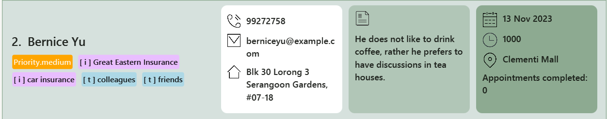

After:

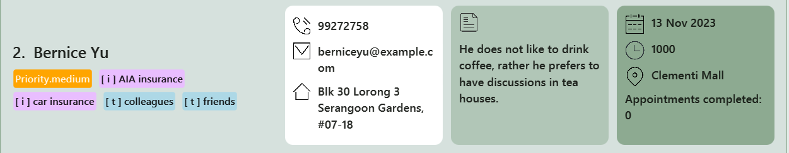

### Updating priority of a customer: `priority`

**Format:**

`priority <index> <priority>`

**Description:**

* Updates the priority of the customer at the specified `<index>` in the displayed customer list to `<priority>`.
* If the customer has not been assigned any priority previously, `<priority>` is assigned directly to the customer.
* If `<priority>` is  `-` , the priority previously assigned the customer will be **removed**.
<box type="warning" seamless>

**Caution:**
* `<index>` should **only be one of** the indices shown in the displayed list.
* `<priority>` should **only be one of：** `high`, `medium`, `low`, `-` (all case-insensitive).

</box>

<box type="info" seamless>

**Note:**
* The customer list is sorted by priority according to this order: `high` -> `medium` -> `low`  
* Customers with no priority assigned to them will be displayed at the bottom of the list.  
* Changing a customer's priority **may** change its position in the list because of the sorted property.
</box>

**Examples:**

* `priority 3 high` updates the priority of the third customer to be `high`. Note that the position of the customer is changed.

Before:

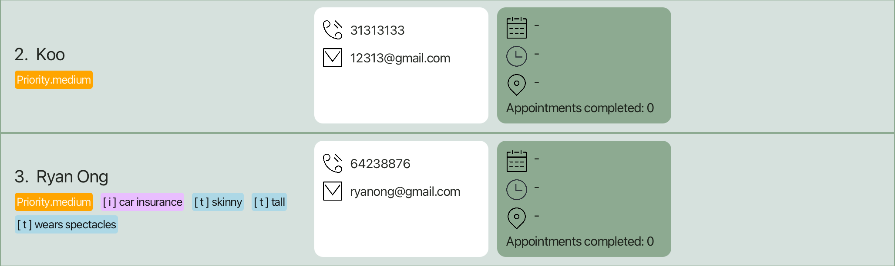

After:

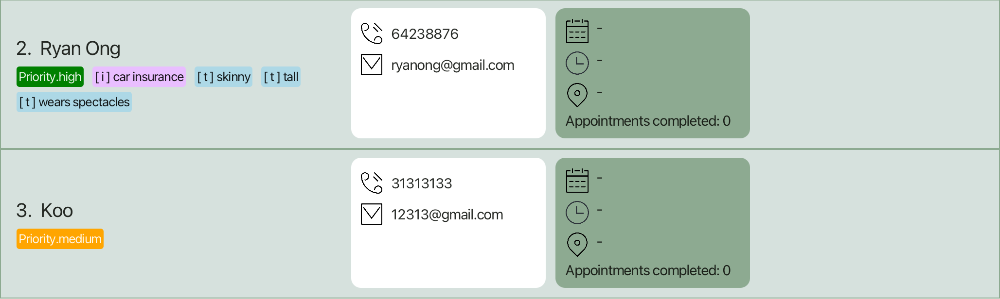

 

* `priority 3 -` removes the priority assigned to the third customer. Note that the customer remains at the bottom of the list.

Before:

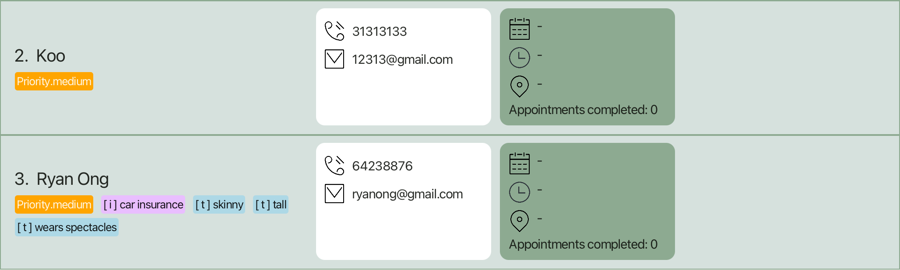

After:

### Adding a remark to a customer: `remark`

Format: `remark <index> <remark>`

**Description:**

* Add/updates the remark of the customer at `<index>` in the displayed customer list.
* If you wish to delete the remark, update the remark without text after the command, i.e. `remark <index>`.

<box type="warning" seamless>

**Caution:**
* `<index>`should **only be one of** the indices shown in the displayed list.
* `<remark>` cannot be longer than 150 characters.

</box>

Examples:

* `remark 4 he likes pizza` Updates the remark of the first customer in the displayed list to `he likes pizza`.

Before :

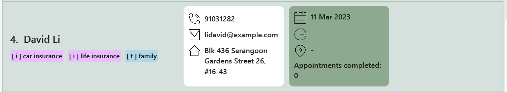

After:

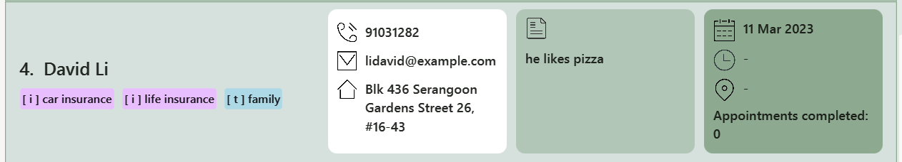

* `remark 4` Removes the remark from the second customer in the displayed list.

Before :

After:

### Adding an appointment to a customer: `addappt`

**Format:**
`addappt <index> d/<date> [t/<time>] [v/<venue>]`

**Description:**

* Adds an appointment to the customer at `<index>` in the displayed customer list.
* An appointment can includes a date, time and venue.
* This allows you to keep track of all your customers' appointment dates all within the same app
* If you wish to delete the customer's appointment, use the command `deleteappt`

<box type="warning" seamless>

**Caution:**

* The customer must not have a current appointment
* `<index>` should **only be one of** the indices shown in the displayed list
* `<date>` must be specified
* `<date>` must be in YYYY-MM-DD format, not a past date and a valid date
(eg. 30 Feb 2025 is invalid).
* `<time>` format must be in 24h HH:MM format
* `<venue>` cannot be longer than 30 characters

</box>

**Examples:**

* `addappt 1 d/2025-12-12` adds an appointment on 12 Dec 2025 for the first customer in the displayed list

* `addappt 1 d/2025-12-12 t/12:55` adds an appointment on 12 Dec 2025, 1255hrs for the first customer in the displayed list

* `addappt 1 d/2025-12-12 t/12:55 v/Clementi Mall` adds an appointment on 12 Dec 2025, 1255hrs, Clementi Mall for the first customer in the displayed list

Before:

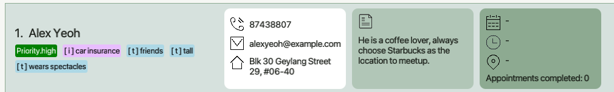

After:

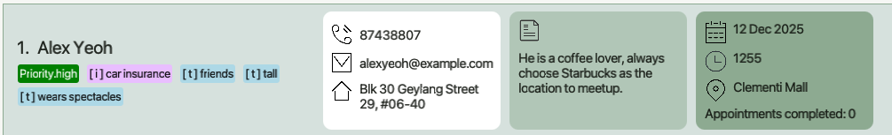

### Deleting a customer's appointment: `deleteappt`

**Format:**
`deleteappt <index>`

**Description:**

* Deletes a customer's appointment at `<index>` in the displayed customer list.\
* Used when the appointment has been cancelled.

<box type="warning" seamless>

**Caution:**

* The customer must have a current appointment
* `<index>` should **only be one of** the indices shown in the displayed list
* Cannot be undone

</box>

**Examples:**
* `deleteappt 1` deletes the appointment of the first customer in the displayed list, if applicable

Before:

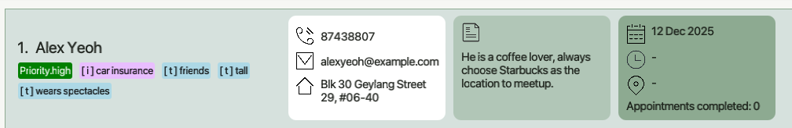

After:

### Marking an appointment: `markappt`

**Format:**
`markappt <index>`

**Description:**
* Marks the appointment of the customer at `<index>` in the displayed customer list.
* Increments the customer's completed appointments count by 1.
* Deletes the current appointment.
* Use to keep track of the number of completed appointments with the customer

<box type="warning" seamless>

**Caution:**
* `<index>` should **only be one of** the indices shown in the displayed list
* The customer at `<index>` must have a current appointment.
* This cannot be undone.

</box>

**Example:**
* `markappt 1` increments the appointment counter of the first customer in the displayed list.

Before:

After:

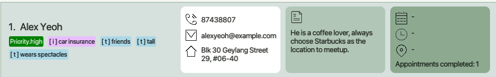

### Unmarking an appointment: `unmarkappt`

**Format:**

`unmarkappt <index>`

**Description:**

* Decrements the customer's completed appointments count at `<index>` by 1.
* Use to reduce the appointment count of customers as needed.

<box type="warning" seamless>

**Caution:**
* `<index>` should **only be one of** the indices shown in the displayed list
* This cannot be undone.
* The current appointment count must be greater than 0.

</box>

**Examples:**
* `unmarkappt 1` decrements the appointment counter of the first customer in the displayed list by 1.

### Listing all customers : `list`

**Format:**
`list`

**Description**
* Shows a list of all customers in EZContact and the size of the list.
* You can return to viewing your full client list after executing a `find` command.
* No parameter is needed for this command, all parameter provided will be ignored.

**Example**:
* `list` shows a list of all existing customers and the size of the list.
* `list 123` will be interpreted as `list`.

 

----------------------------------------------------------------------------------------------------------------
 

### Clearing the customer list : `clear`

**Format:**
`clear`

**Description:**
* Clears the customer list.
* No parameter is needed for this command, all parameter provided will be ignored.

**Examples:**

* `clear` clears the customer list in EzContact.
* `clear 123` will be interpreted as `clear`.

### Requesting for help : `help`

**Format:**
`help`

**Description:**
* Opens the help window.
* No parameter is needed for this command, all parameter provided will be ignored.

**Examples:**

* `help` opens the help window.
* `help 123` will be interpreted as `help`.

 

----------------------------------------------------------------------------------------------------------------
 

### Exiting the program : `exit`

**Format:**

`exit`

**Description:**
* Exits the program.
* No parameter is needed for this command, all parameter provided will be ignored.

**Examples:**

* `exit` exits EzContact.
* `exit 123` will be interpreted as `exit`.

## Advanced Features

### Managing data

EzContact's data is stored as a json file at : `<JAR file directory>/data/addressbook.json`, where `<JAR file directory>`
is the directory you placed our `EzContact.jar` file.

**Saving data:**

EzContact's data is saved automaticaly whenever a command that changes the data is executed.

**Editing the data file:**

Advanced users are welcomed to update the data stored in EzContact directly by editing the `addressbook.json` file.

<box type="warning" seamless>

**Caution:**
If the format of the file becomes invalid after an edit, EzContact will launch with an empty data file, and will
overwrite the whole data file after a command that changes the data file is executed. Hence, users are **strongly
recommended to store a backup** of the data file before editing it.

</box>

**Storing/Restoring backup data files:**

Users can store a backup of the current data file by simply creating a copy of the `addressbook.json` file.
To restore a previously backed-up file, simply place the json file in the `<JAR file directory>/data` directory
and rename the file to `addressbook.json`.

 

----------------------------------------------------------------------------------------------------------------
 

## FAQ

**Q:** Can I transfer my data to another computer?  
**A:** Yes, you can. Install EzContact in the computer and replace the `addressbook.json` file in the `<JAR file directory>/data` directory
with the `addressbook.json` file from your previous computer.    
**Q:** Why are there sample customers when I first launch EzContact and how do I get rid of them?  
**A:** The sample customers are for new users to try out various commands in EzContact. To get rid of them, simply type `clear` in the
command box.

## Command summary

| Action         | Format and Examples                                                                                                                                                                                                                              |
|----------------|--------------------------------------------------------------------------------------------------------------------------------------------------------------------------------------------------------------------------------------------------|
| **Add**        | `add n/<name> p/<phone number> e/<email> [a/<address>] [pr/<priority>] [t/<tag>]... [i/<insurance>]... [r/<remark>]`          
           `add n/James Ho p/22224444 e/jamesho@example.com a/123, Clementi Rd, 1234665 t/tall r/some remarks` |
| **Delete**     | `delete <index>`                                            
       `delete 3`                                                                                                                                                                |
| **Edit**       | `edit <index> [n/<name>] [p/<phone number>] [e/<email>] [a/<address>] ` 
 `edit 2 n/James Lee e/jameslee@example.com`                                                                                                                         |
| **Find**       | `find [n/<keywords>] [p/<keywords>] [e/<keywords>] [a/<keywords>] [t/<keywords>] [i/<keywords>] [pr/<keywords>] [r/<keywords>]`                      
      `find n/song i/abc`                                                               |
| **Tag**        | `tag <index> [at/<tag to add>]... [dt/<tag to delete>]...`     
         `tag 1 at/tall dt/short at/male`                                                                                                                                     |
| **Insurance**  | `insurance <index> [ai/<insurance to add>]... [di/<insurance to delete>]...`     
         `insurance 2 ai/AIA insurance di/Great Eastern Insurance`                                                                                          |
| **Remark**     | `remark <index> <remark>` 
   `remark 2 some remarks`                                                                                                                                                                                         |
| **Priority**   | `priority <index> <priority>`  
  `priority 1 medium`       

                                                                                                                                                                                 |
| **Addappt**    | `addappt <index> d/<date> [t/<time>] [v/<venue>]` 
 `addappt 3 d/2025-12-12 t/23:59 v/Starbucks`                                                                                                                                              |
| **Deleteappt** | `deleteappt <index>` 
 `deleteappt 1`                                                                                                                                                                                                         |
| **Markappt**   | `markappt <index>` 
 `markappt 1`                                                                                                                                                                                                             |
| **Unmarkappt** | `unmarkappt <index>` 
 `unmarkappt 1`                                                                                                                                                                                                         |
| **List**       | `list`                                                                                                                                                                                                                                           |
| **Clear**      | `clear`                                                                                                                                                                                                                                          |
| **Help**       | `help`                                                                                                                                                                                                                                           |
| **Exit**       | `exit`                                                                                                                                                                                                                                           |

#### Prefix to full-name prefix translation table

****Note that prefixes are not case-sensitive**

| Prefix | Full-name prefix | Remarks                                  |
|--------|------------------|------------------------------------------|
| n/     | name/            |                                          |
| p/     | phone/           |                                          |
| e/     | email/           |                                          |
| a/     | address/         |                                          |
| pr/    | priority/        |                                          |
| t/     | tag/             | used in `add` command                     |
| i/     | insurance/       |                                          |
| r/     | remark/          |                                          |
| at/    | addtag/          |                                          |
| dt/    | deletetag/       |                                          |
| ai/    | addinsurance/    |                                          |
| di/    | deleteinsurance/ |                                          |
| d/     | date/            |                                          |
| t/     | time/            | used in **appointment** related commands |
| v/     | venue/           |                                          |

## Glossary

| Term                           | Meaning                                                                                                                            |
|--------------------------------|------------------------------------------------------------------------------------------------------------------------------------|
| Alphanumeric                   | Alphanumeric characters include uppercase letters from ‘A’ to ‘Z’, lowercase letters from ‘a’ to ‘z’, and numbers from ‘0` to ‘9’. |
| json file                      | Acronym for JavaScript Object Notation file, a file format that stores data in a human-readable form.                              |
| Command-line Interface (CLI)   | Text-based user interface that receives text commands to run the program                                                           |
| Graphical User Interface (GUI) | Interface where user interact with graphical component, such as icons, buttons and menus to run the program                        |

